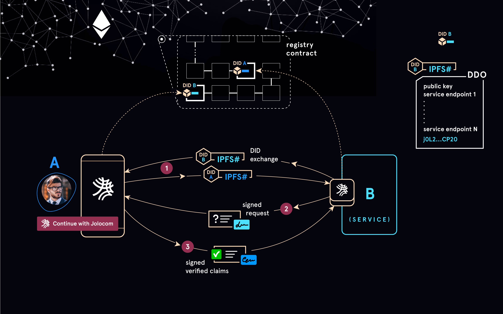

============
Introduction
============

This section provides a brief overview of the protocol architecture, an introductory understanding on how to 
navigate the Jolocom library, as well as some context on the concept of self-sovereign identity.

**System Architecture**

The Jolocom protocol is build using the following core components:

* `Hierarchical Deterministic Key Derivation <https://github.com/bitcoin/bips/blob/master/bip-0032.mediawiki>`_ enables pseudonymous, context specific interactions through the creation of and control over multiple identities.

* `Decentralized Identifiers <https://w3c-ccg.github.io/did-spec/>`_ (DIDs) are associated with each identity and used during most interaction flows explore later, such as authentication or data exchange.

* `Verifiable Credentials <https://w3c.github.io/vc-data-model/>`_ are digitally signed attestations issued by an identity. The specification ca be used to develop a simple way of associating attribute information with identifiers.

* A public, censorship resistent, decentralized network for anchoring and resolving user identifiers, (currently IPFS for storage, and Ethereum for aiding resolution)

.. warning:: Please be aware that the Jolocom library is still in early stages, we are currently anchoring all identities on the Rinkeby testnet.

  Please do not transfer any real ether to your Jolocom identity.

**Interaction Flows Visualized**

We are currently working on diagrams to illustrate the main interaction flows, coming soon.

#########################
The Jolocom Library at a Glance
#########################

The Jolocom library exposes a JolocomLib interface with four main entry points:

* parse
* registry
* identityManager
* unsigned

Verifiable Credentials and DID/DidDocuments are JSON-LD data types. 
The Jolocom library exposes methods on their respective classes for serialization and deserialization.

The parse functionality allows for the parsing of credential requests and responses 
``fromJSON`` (JSON-LD) or ``fromJWT``.

The JolocomRegistry class is used to register the identity, perform any updates, and also contains the mechanism 
for resolution of DIDs to their corresponding DidDocuments.

The IdentityManager class is used to create and manage your keys.

The unsigned functionality enables usage patterns which do not require a private key.

The Jolocom library also exposes claimsMetadata. Because verifiable credentials are structured as JSON-LD documents,
you will need to provide further information in addition to the subject matter of the credential.

In the case of an email address, the metadata would be:

.. literalinclude:: ../ts/index.ts
  :language: typescript
  :lines: 24-36

The actual email claim would be:

.. code-block:: typescript

  {
    
    id: 'did:jolo:5dcbd50085819b40b93efc4f13fb002119534e9374274b10edce88df8cb311af'
    
    email: 'hello@jolocom.com'
  
  }

The Jolocom library tries to accomodate for commonly used credential types in order to make credential creation
as simple as possible.

##################################
What is a Self-Sovereign Identity?
##################################

Coming soon.
